<h1 align="center">
✈️ Airline Booking System
</h1>

<p align="center">
A scalable airline booking backend built with a production-style Microservices Architecture using Node.js, Express, RabbitMQ, MySQL, Amazon RDS and AWS EC2.
</p>

<h3 align="center">
Production-Ready Airline Booking Platform built using Microservices Architecture
</h3>

<p align="center">


</p>

---

# 📖 Overview

The **Airline Booking System** is a production-style backend application developed using **Microservices Architecture**. Instead of building a single monolithic application, the system is divided into independent services responsible for authentication, flight management, booking, notification, and request routing.

The project demonstrates how modern distributed backend systems communicate using REST APIs and asynchronous messaging while remaining independently deployable.

The complete application is deployed on **AWS EC2**, uses **Amazon RDS MySQL** for persistent storage, **RabbitMQ** for asynchronous communication, and **PM2** for production process management.

---

# 🚀 Features

- 🔐 JWT Authentication & Authorization
- ✈️ Flight Search
- 🏙️ City Management
- 🛫 Airport Management
- 🎫 Flight Booking
- 💺 Seat Reservation
- 📧 Email Reminder Service
- 📨 RabbitMQ Message Queue
- 🌐 API Gateway
- ☁️ AWS EC2 Deployment
- 🗄️ Amazon RDS Database
- ⚡ PM2 Process Manager
- 🔄 RESTful APIs
- 🛠 Sequelize ORM

---

# 🏗️ System Architecture

<p align="center">
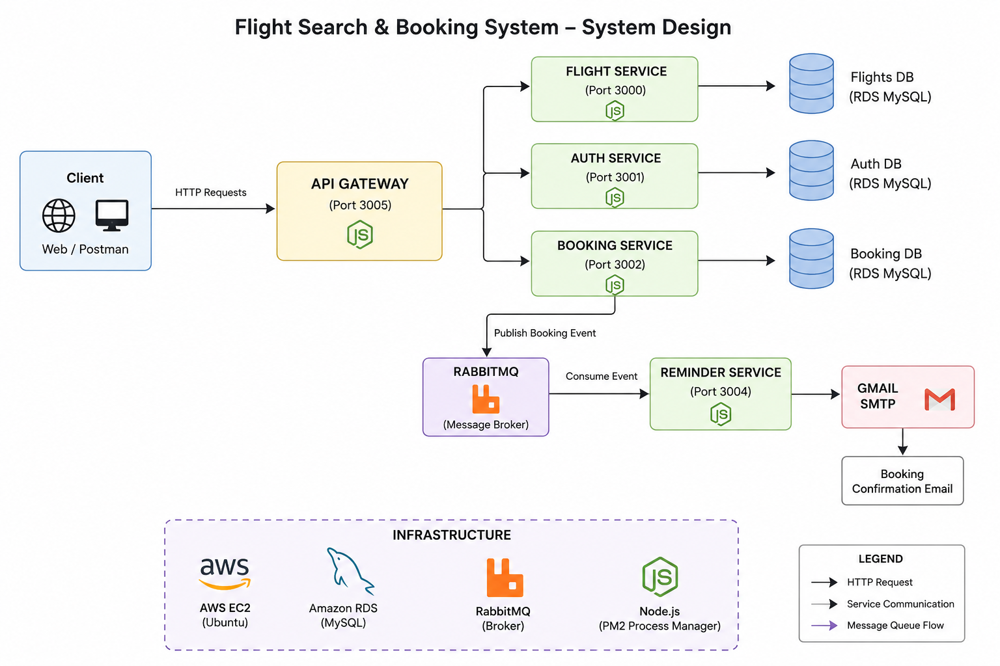
</p>

---

# 🔄 Request Flow

```text
                    Client
                      │
                      ▼
              API Gateway (3005)
                      │
      ┌───────────────┼────────────────┐
      ▼               ▼                ▼
 Auth Service    Flight Service   Booking Service
    (3001)           (3000)            (3002)
       │                │                 │
       │                │                 │
       └────────────────┼─────────────────┘
                        │
                        ▼
               Amazon RDS (MySQL)

Booking Service
        │
        ▼
 RabbitMQ Exchange
        │
        ▼
 Reminder Service
        │
        ▼
 Email Notification
```

---

# 🏛️ Microservices

| Service | Description |
|----------|-------------|
| API Gateway | Single entry point for all client requests |
| Auth Service | Handles Signup, Login, JWT Authentication & Authorization |
| Flight & Search Service | Manages Cities, Airports and Flights |
| Booking Service | Handles flight booking and seat reservation |
| Reminder Service | Consumes RabbitMQ events and sends reminder emails |

---

# 📂 GitHub Repositories

| Repository | Link |
|------------|------|
| API Gateway | [API_Gateway](https://github.com/Lovejindal1/API_Gateway) |
| Auth Service | [Auth Service](https://github.com/Lovejindal1/Auth_Service) |
| Flight & Search Service | [Flight & Search Service](https://github.com/Lovejindal1/FlightAndSearchService) |
| Booking Service | [Booking Service](https://github.com/Lovejindal1/AirticketBookingService) |
| Reminder Service | [Reminder Service](https://github.com/Lovejindal1/ReminderService) |

---

# 🛠 Tech Stack

| Category | Technology |
|-----------|------------|
| Runtime | Node.js |
| Framework | Express.js |
| Database | MySQL |
| ORM | Sequelize |
| Authentication | JWT |
| Message Broker | RabbitMQ |
| Cloud | AWS EC2 |
| Database Hosting | Amazon RDS |
| Process Manager | PM2 |
| API Testing | Postman |
| Version Control | Git & GitHub |

---

# 🚀 Deployment

The complete backend has been deployed on an AWS EC2 instance.

Each microservice runs independently under PM2.

| Service | Port |
|---------|------|
| Flight Service | 3000 |
| Auth Service | 3001 |
| Booking Service | 3002 |
| Reminder Service | 3004 |
| API Gateway | 3005 |

Database is hosted on **Amazon RDS MySQL** and asynchronous communication is handled through **RabbitMQ**.

---

# 📁 Project Structure

```
Airline-Booking-System
│
├── API_Gateway
├── Auth_Service
├── FlightAndSearchService
├── AirticketBookingService
├── ReminderService
│
├── docs
├── images
└── README.md
```

---

# ☁️ Deployment Architecture

The application is deployed on an **AWS EC2 Ubuntu Instance**.

### Infrastructure

- Ubuntu EC2
- Amazon RDS (MySQL)
- RabbitMQ
- PM2
- Node.js
- Express.js

Every microservice runs independently and communicates through REST APIs or RabbitMQ.

---

# 📡 API Flow

```text
Client

↓

API Gateway

↓

Authentication

↓

Business Logic

↓

Amazon RDS

↓

RabbitMQ

↓

Reminder Service

↓

Email Notification
```

---

# 📸 Screenshots

### AWS EC2

<p align="center">
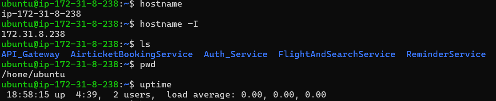
</p>

---

### Amazon RDS

<p align="center">
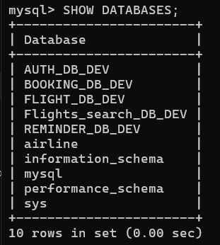
</p>

---

### RabbitMQ

<p align="center">
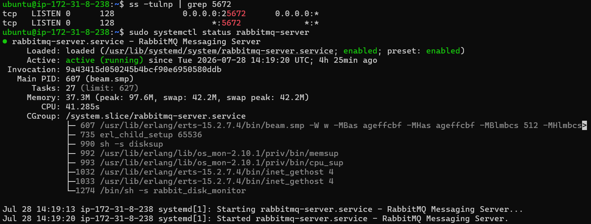
</p>

---

### Node Services Running

<p align="center">
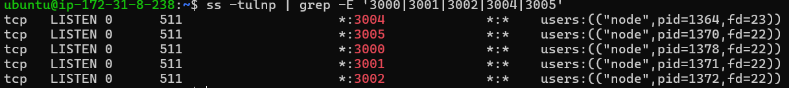
</p>

---

### PM2

<p align="center">
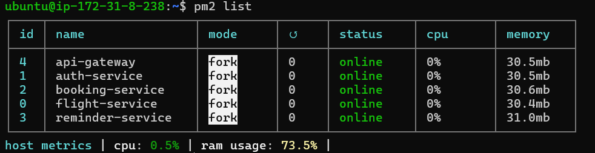
</p>

---

### API Testing

<p align="center">
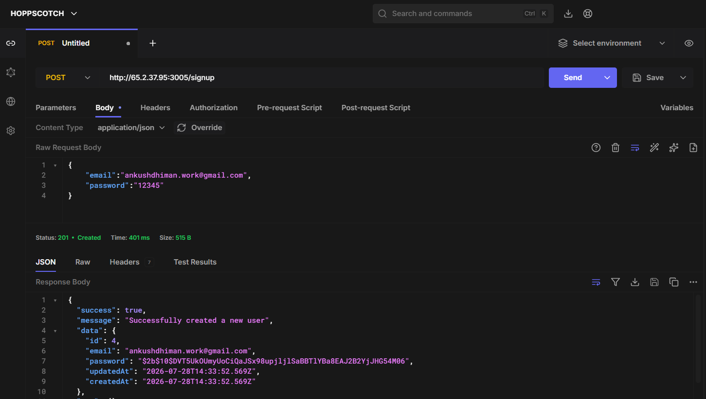
<br><br>
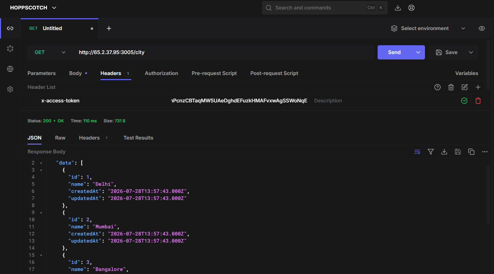
<br><br>
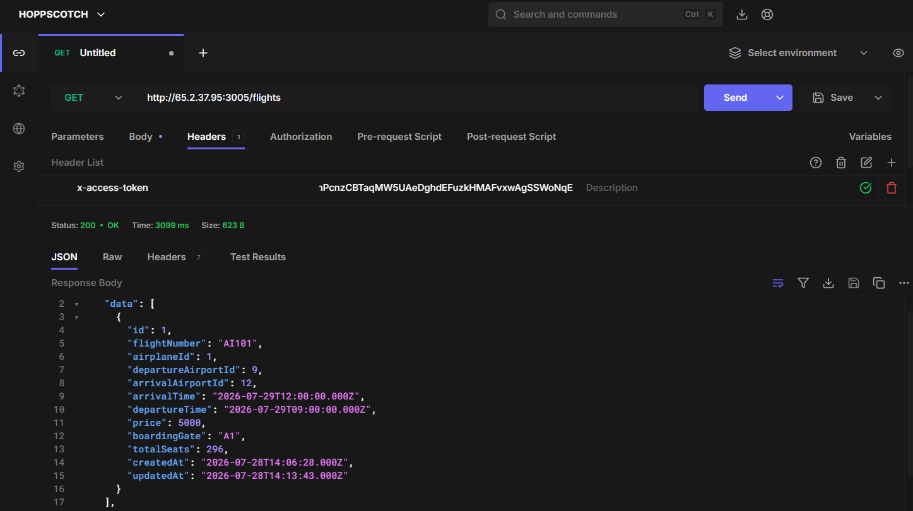
<br><br>
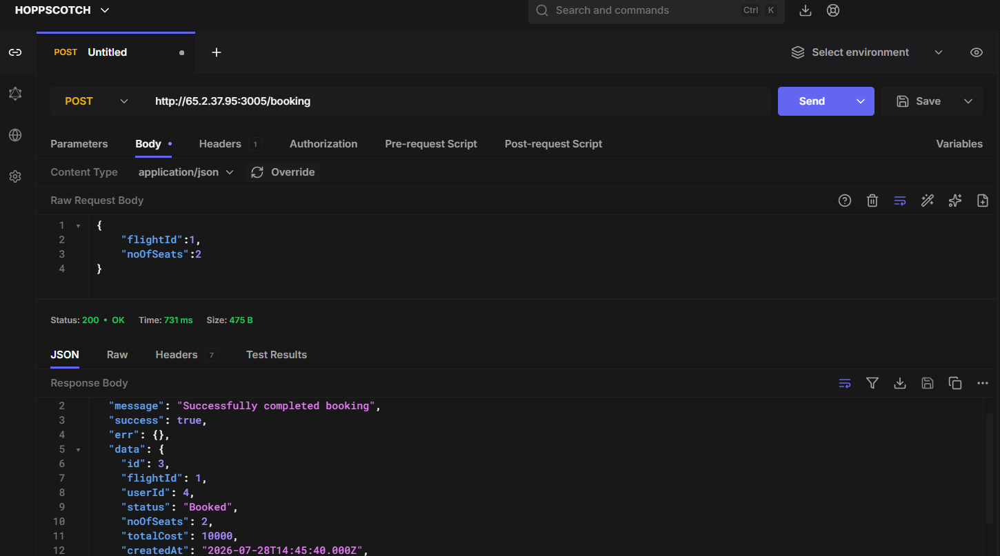
</p>

---

### Email Reminder

<p align="center">
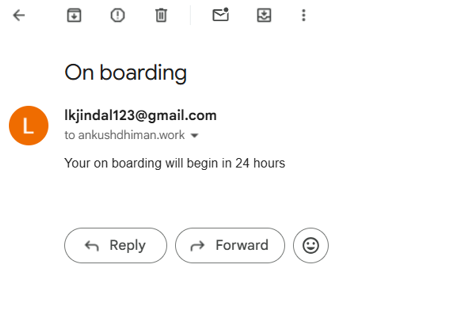
</p>

---

# 🤝 Contributing

Contributions, issues and feature requests are welcome.

If you find any bugs or have suggestions for improvement, feel free to open an issue or submit a pull request.

---

# 👨‍💻 Author

## 👨‍💻 Love Jindal

Backend Developer passionate about building scalable backend systems using Node.js, Express, AWS and Microservices.

### Connect

- GitHub: https://github.com/Lovejindal1
- LinkedIn: https://www.linkedin.com/in/love-kumar-jindal/

---

⭐ If you found this project useful, consider giving it a star on GitHub. It helps others discover the project.